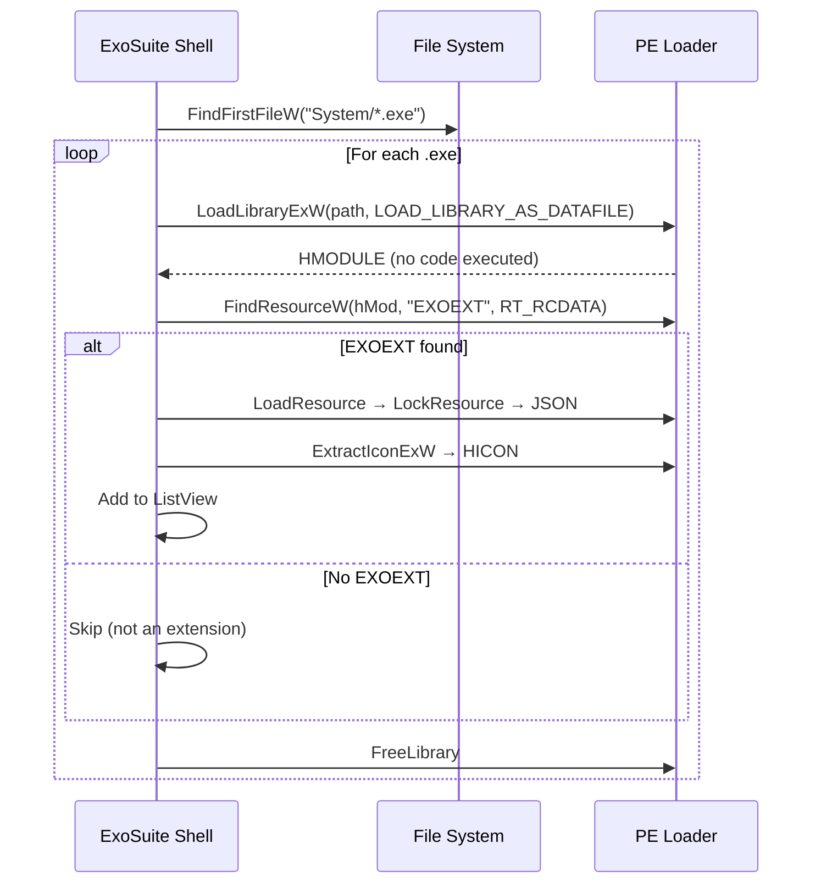

# ExoSuite Extension System — Self-Describing Executables

## Overview

ExoSuite discovers extensions by scanning the `System/` folder for `.exe` files that contain an embedded **EXOEXT** resource. No external config files, no registry entries, no installation step — the executable _is_ the manifest.

**Drop an `.exe` into `System/` → ExoSuite finds it automatically.**

## How It Works

```
ExoSuite.exe ← shell (lives in Bin/Release/)
System/
  ├── Console.exe    ← has EXOEXT → discovered ✓
  ├── RegStudio.exe  ← has EXOEXT → discovered ✓
  ├── ExoUI.dll      ← no EXOEXT  → skipped
  └── Lucide.dll     ← no EXOEXT  → skipped
```

### Discovery Flow



### Key Win32 APIs

| API                                           | Purpose                                                             |
| --------------------------------------------- | ------------------------------------------------------------------- |
| `LoadLibraryExW` + `LOAD_LIBRARY_AS_DATAFILE` | Load PE for resource reading only — no `DllMain`, no code execution |
| `FindResourceW(hMod, "EXOEXT", RT_RCDATA)`    | Locate the EXOEXT custom resource                                   |
| `LoadResource` + `LockResource`               | Get a pointer to the raw JSON bytes                                 |
| `ExtractIconExW`                              | Pull the application icon from the PE                               |

## Creating an Extension

### 1. Create `exoext.json`

```json
{
  "name": "Console",
  "description": "Multi-tab terminal emulator with ConPTY backend",
  "version": "0.1.0",
  "category": "Development",
  "icon": "terminal",
  "author": "Rizonesoft"
}
```

| Field         | Required | Description                                        |
| ------------- | -------- | -------------------------------------------------- |
| `name`        | Yes      | Display name in the shell ListView                 |
| `description` | Yes      | Short description shown in the Description column  |
| `version`     | Yes      | Semantic version string                            |
| `category`    | Yes      | Sidebar category for grouping                      |
| `icon`        | No       | Lucide icon name (for future sidebar/category use) |
| `author`      | No       | Author attribution                                 |

### 2. Embed in Resource Script

```rc
#include <windows.h>

// Application Icon
1 ICON "Console.ico"

// Application Manifest
1 24  "app.manifest"

// EXOEXT — self-describing extension metadata
EXOEXT RCDATA "exoext.json"
```

The critical line is `EXOEXT RCDATA "exoext.json"` — this embeds the JSON as a custom named resource of type `RT_RCDATA`.

### 3. Set CMake Output to `System/`

```cmake
set(CMAKE_RUNTIME_OUTPUT_DIRECTORY_RELEASE "${CMAKE_SOURCE_DIR}/Bin/Release/System")
```

### 4. Build and verify

```bash
# Build everything
powershell -File exokit/Build-ExoSuite.ps1 -Release

# Verify the extension is in System/
ls Bin/Release/System/*.exe
```

Launch ExoSuite — your extension should appear in the ListView with its icon, name, description, version, size, and modification date.

## Architecture Principles

1. **Zero external dependencies** — no manifests, config files, or registry keys
2. **Safe scanning** — `LOAD_LIBRARY_AS_DATAFILE` never executes code
3. **Extensible metadata** — JSON format allows future fields without breaking compatibility
4. **Icon extraction** — real application icon displayed, not a generic shell icon
5. **Drop-in deployment** — copy `.exe` to `System/`, restart shell, done
6. **Clean removal** — delete the `.exe`, restart shell, gone
