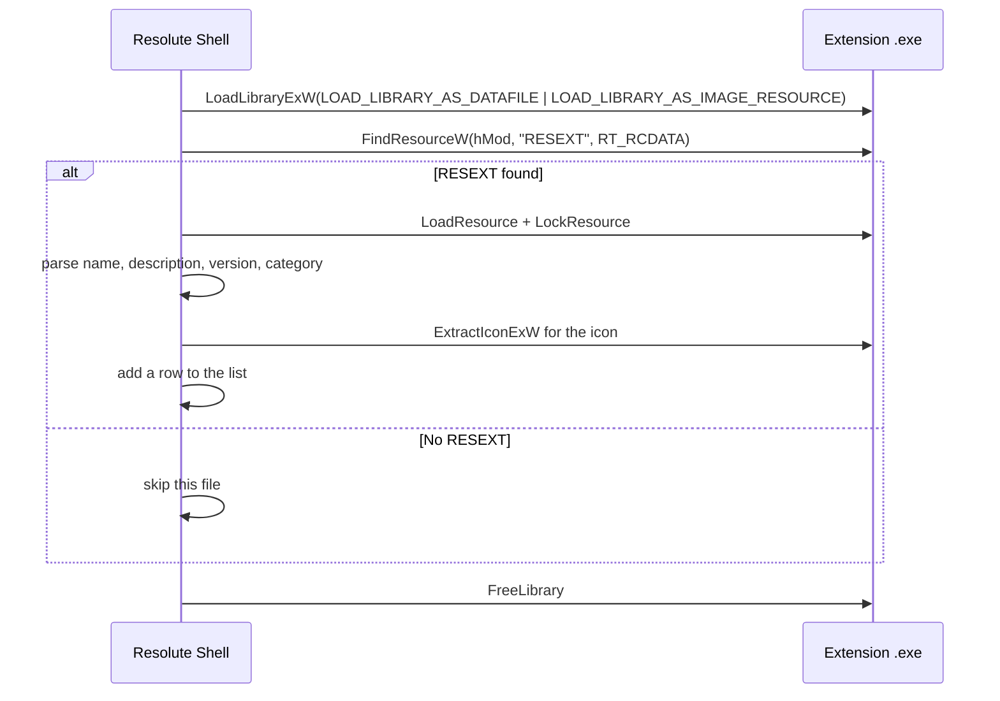

# Resolute Extension System — Self-Describing Executables

Resolute discovers extensions by scanning the `System/` folder for `.exe` files that contain an embedded **RESEXT** resource. No external config files, no registry entries, no installation step — the executable _is_ the manifest.

**Drop an `.exe` into `System/` → Resolute finds it automatically.**

> **Renamed 2026-09-17 by `D00 T03 §3`.** This resource was called `EXOEXT` while the product was called ExoSuite. It is now `RESEXT`. The rename was made after confirming no executable emitted the old name, so there is no compatibility window: an extension embedding `EXOEXT` is not discovered and never was by any shipped build.

```
Bin/Release/
  Resolute.exe          ← shell
  System/
    ├── RegStudio.exe   ← has RESEXT → discovered ✓
    ├── ResoluteUI.dll  ← no RESEXT  → skipped
    └── Lucide.dll      ← no RESEXT  → skipped
```

## How discovery works

The shell enumerates `System/*.exe` and, for each one, opens the PE **as data only** and looks for the resource. A file without it is skipped and never executed.



### Key Win32 APIs

| API | Purpose |
| --- | --- |
| `LoadLibraryExW` + `LOAD_LIBRARY_AS_DATAFILE \| LOAD_LIBRARY_AS_IMAGE_RESOURCE` | Load the PE for resource reading only — no `DllMain`, no code execution |
| `FindResourceW(hMod, L"RESEXT", RT_RCDATA)` | Locate the RESEXT custom resource |
| `LoadResource` + `LockResource` | Get a pointer to the raw JSON bytes |
| `ExtractIconExW` | Pull the application icon from the PE |

**Scanning never runs the extension.** `LOAD_LIBRARY_AS_DATAFILE` maps the file for resource access without calling `DllMain` or any entry point, which is what makes it safe to point the shell at a folder of executables it did not build.

The implementation is `ScanExtensions()` in [`src/main.cpp`](../src/main.cpp).

## Creating an Extension

### 1. Write `resext.json`

```json
{
  "name": "RegStudio",
  "description": "Registry editor and comparison tool",
  "version": "0.1.0",
  "category": "System",
  "icon": "database",
  "author": "Rizonesoft"
}
```

**Only four fields are read today.** The others are accepted and ignored, which is deliberate — the format is JSON so fields can be added without breaking older shells — but do not rely on them doing anything yet.

| Field | Read by the shell | Description |
| --- | --- | --- |
| `name` | **yes** | Display name. Falls back to the file name when absent |
| `description` | **yes** | Description column. Falls back to `category` when absent |
| `version` | **yes** | Version column. Shows an em dash when absent |
| `category` | **yes** | Sidebar category for grouping |
| `icon` | no | Intended as a Lucide icon name. Nothing reads it; the displayed icon comes from the PE |
| `author` | no | Attribution. Nothing reads it |

The icon shown in the list is extracted from the executable with `ExtractIconExW`, not taken from the JSON, so an extension gets its own application icon for free.

### 2. Embed it in the resource script

```rc
#include <windows.h>

// Application icon
1 ICON "RegStudio.ico"

// Application manifest
1 24  "app.manifest"

// RESEXT — self-describing extension metadata
RESEXT RCDATA "resext.json"
```

The critical line is `RESEXT RCDATA "resext.json"`, which embeds the JSON as a custom named resource of type `RT_RCDATA`. The name must be exactly `RESEXT`: the shell looks it up by name, so a typo produces an executable that builds, runs, and is silently never listed.

### 3. Send the build output to `System/`

```cmake
set(CMAKE_RUNTIME_OUTPUT_DIRECTORY_RELEASE "${CMAKE_SOURCE_DIR}/Bin/Release/System")
```

### 4. Build and verify

```powershell
pwsh scripts/build.ps1 -All
Get-ChildItem Bin/Release/System/*.exe
```

Then launch `Bin/Release/Resolute.exe`. The extension should appear in the list with its icon, name, description, version, size, and modification date.

If it does not appear, the resource is the first thing to check: the executable is in `System/`, the resource is named `RESEXT`, and its type is `RT_RCDATA`.

## Architecture principles

1. **No external dependencies** — no manifests, config files, or registry keys
2. **Safe scanning** — `LOAD_LIBRARY_AS_DATAFILE` never executes code
3. **Extensible metadata** — JSON allows new fields without breaking an older shell
4. **Icon extraction** — the real application icon is displayed, not a generic shell icon
5. **Drop-in deployment** — copy the `.exe` to `System/`, restart the shell, done
6. **Clean removal** — delete the `.exe`, restart the shell, gone

## What this does not do yet

- **Nothing emits `RESEXT` today.** `RegStudio` is the only extension in the tree and does not embed one, so the shell's list is empty on a fresh build. The example above is the contract to write against, not a description of a shipping extension.
- **No version negotiation.** The shell reads whatever fields it knows and ignores the rest. There is no schema version, so a future incompatible change has no way to announce itself.
- **No signature or trust check.** Any `.exe` dropped into `System/` with the right resource is listed. The shell does not verify who produced it.
